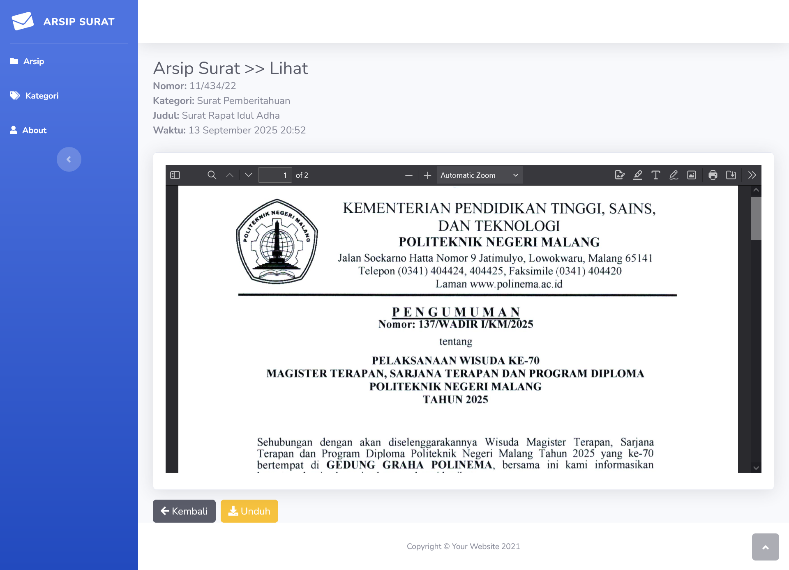

## Arsip Surat App (Letter Archive)

🎯 Tujuan

- Menyediakan aplikasi arsip surat digital untuk Desa Karangduren yang dapat:

- Menyimpan surat resmi dalam format PDF

- Memudahkan pencarian dan pengunduhan surat kapan saja

- Mengurangi ketergantungan pada arsip kertas dan menjaga keamanan dokumen


## Fitur

- Upload Surat PDF – Petugas bisa meng-unggah surat resmi yang telah dipindai.
- Manajemen Kategori – Mengelola kategori surat (tambah, ubah, hapus) agar arsip rapi.
- Pencarian & Filter – Cari surat berdasarkan judul atau kategori.
- Preview & Unduh – Lihat atau unduh file PDF yang tersimpan.


## Instalasi

Lakukan clone terlebih dahulu, lalu masuk ke dalam project

```bash
  git clone https://github.com/Maulidin-Ilham/letter-archive-app.git
  cd letter-archive-app
```
    
Composer install

```bash
composer install
```

Copy .env.example ke .env dengan command dibawah

```bash
  cp .env.example.env
```

Buat database bernama db_letter-archive

Konfigurasi file .env seperti mengganti nama database, nama tabel

Lakukan command dibawah untuk mendapatkan key

```bash
  php artisan key:generate
```

Lakukan migration & seeder

```bash
  php artisan migrate:fresh --seed
```

Langkah terakhir jalankan program

```bash
  php artisan serve
```
## Screenshot





